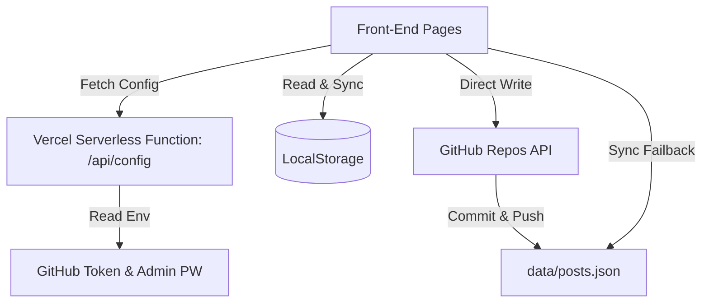

# Board Builder Skill

본 스킬은 GitHub API & Vercel 서버리스 함수 및 LocalStorage 하이브리드를 기반으로 동작하는 초경량 정적 게시판 홈페이지 솔루션 구축 스킬입니다.

## Architecture

## Tech Stack
- **Core**: HTML5, Vanilla JavaScript
- **Styling**: Tailwind CSS CDN
- **Database**: LocalStorage & GitHub REST API v3 Hybrid
- **Deployment**: Vercel Zero-Config serverless backend & static front-end
- **Markdown Parser**: 커스텀 경량 정규식 기반 안전 마크다운 렌더러

## Features
1. **Zero-Config 배포**: `vercel.json`을 사용하여 복잡한 빌드 스크립트 없이 정적 서빙 및 API 기능을 완벽하게 서빙합니다.
2. **보안 지향**: GitHub 토큰 정보가 로컬 저장소에 커밋되어 유출되는 것을 차단하기 위해, 실제 코드에는 노출시키지 않고 Vercel Environment Variables를 통해 백엔드 `/api/config` 엔드포인트에서 동적으로 수급합니다.
3. **안전한 마크다운 렌더러**: 외부 라이브러리 의존성 없이 마크다운 파싱을 구현하되, 입력을 강제로 HTML-Escape 처리하여 XSS 보안 취약점을 예방합니다.
4. **모바일 최적화**: 모바일 사용성을 극대화하기 위해 하단 고정형 탭바 네비게이션(Bottom Nav) 및 44x44px 이상의 터치 타겟을 확보하고 반응형 그리드 시스템을 탑재하였습니다.
